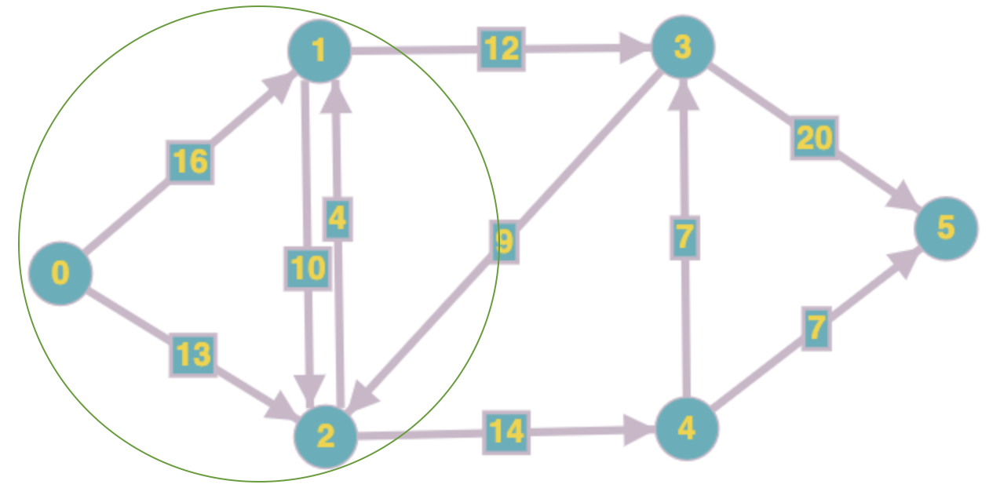
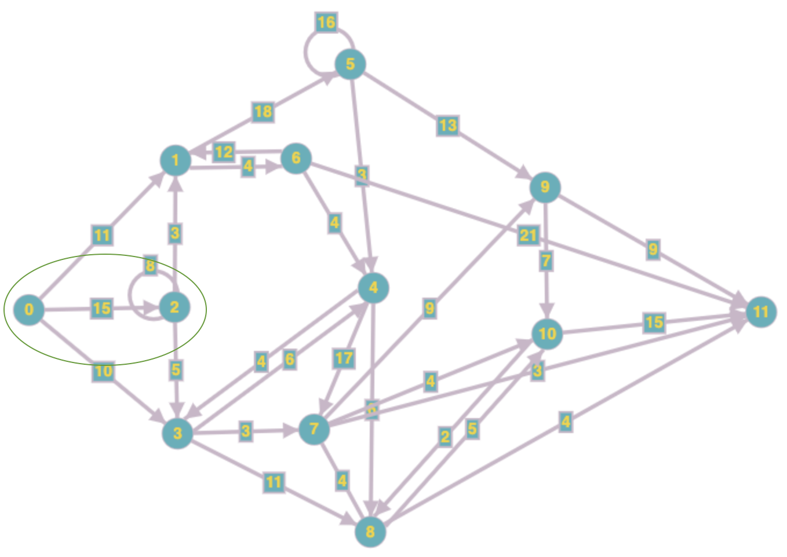

# Linear-Program-Solvers

### Introduction
- This repository contains implementations of following [linear program (LP)](https://en.wikipedia.org/wiki/Linear_programming) solver algorithms in Python and NumPy:
    1. [Simplex algorithm](https://en.wikipedia.org/wiki/Simplex_algorithm)
    2. Primal-Dual Infeasible [Interior Point](https://en.wikipedia.org/wiki/Interior-point_method) method
    3. Brute force algorithm (exhaustive search over all possible bases)
- The solvers are tested on concrete [max-flow (network flow)](https://en.wikipedia.org/wiki/Maximum_flow_problem) problems (see _Results_ section below)   
- Refer to in-code documentation and comments for description of how the code is working

### Repository structure
- Directory `solvers/` contains the implementation of the mentioned solvers
    1. Implementation of  `SimplexSolver` class  can be found in  `solvers/simplex_solver.py`
    2. Implementation of  `InteriorPointSolver` class can be found in `solvers/interior_point_solver.py` 
    3. Implementation of `BruteSolver` class can be found in `solvers/brute_solver.py`
- `utils.py` contains definition of the following useful helper functions:
    1.  `network_flow_to_std_LP()` that converts a given max-flow problem instance to its corresponding LP
    2. `primal_to_dual()` that converts a given primal LP in standard form to its corresponding dual in standard form
- `main.py` contains example driver code that solves two max-flow problem instances using the solvers 

### Results
We test `SimplexSolver` and `InteriorPointSolver` on two separate max-flow instances. 
- Network for first max-flow instance is given below (green circle marks a [min-cut](https://en.wikipedia.org/wiki/Minimum_cut#With_Terminals) of the network)

    
`SimplexSolver` gives the following flow assignment for this instance:

| Edge | Flow | Capacity |
| ------ | ------| ---------- |
|(0,  1) | 16 | 16 |
|(0,  2) | 10 | 13 |
|(1,  2) |  8 | 10 |
|(1,  3) | 12 | 12 |
|(2,  1) |  4 |  4 |
|(2,  4) | 14 | 14 |
|(3,  2) |  0 |  9 |
|(3,  5) | 19 | 20 |
|(4,  3) |  7 |  7 |
|(4,  5) |  7 |  7 |

The total flow leaving source (vertex-0) in the above flow assignment (16 + 10 = 26) is equal to the sum of the capacities of edges going out of the cut shown above in green (12 + 14 = 26). Hence, this flow assignment is optimal [(cf. max-flow min-cut theorem)](https://en.wikipedia.org/wiki/Max-flow_min-cut_theorem) 

- Network for second max-flow instance is given below (green circle marks a [min-cut](https://en.wikipedia.org/wiki/Minimum_cut#With_Terminals) of the network)

    
`InteriorPointSolver` gives the following flow assignment for this instance:

| Edge | Flow | Capacity |
| ------ | ------| ---------- |
| ( 0,  1) |  11.00 | 11 |
| ( 0,  2) |   8.00 | 15 |
| ( 0,  3) |  10.00 | 10 |
| ( 1,  5) |  11.09 | 18 |
| ( 1,  6) |   3.48 |  4 |
| ( 2,  1) |   3.00 |  3 |
| ( 2,  2) |   4.00 |  8 |
| ( 2,  3) |   5.00 |  5 |
| ( 3,  4) |   5.17 |  6 |
| ( 3,  7) |   2.27 |  3 |
| ( 3,  8) |   8.33 | 11 |
| ( 4,  3) |   0.76 |  4 |
| ( 4,  7) |   5.72 | 17 |
| ( 4,  8) |   1.05 |  6 |
| ( 5,  4) |   1.76 |  3 |
| ( 5,  5) |   8.00 | 16 |
| ( 5,  9) |   9.33 | 13 |
| ( 6,  1) |   0.58 | 12 |
| ( 6,  4) |   0.61 |  4 |
| ( 6, 11) |   2.30 | 21 |
| ( 7,  8) |   1.00 |  4 |
| ( 7,  9) |   4.64 |  9 |
| ( 7, 10) |   3.02 |  4 |
| ( 7, 11) |   2.33 |  3 |
| ( 8,  7) |   3.00 |  4 |
| ( 8, 10) |   4.37 |  5 |
| ( 8, 11) |   3.50 |  4 |
| ( 9, 10) |   5.83 |  7 |
| ( 9, 11) |   8.14 |  9 |
| (10,  8) |   0.49 |  2 |
| (10, 11) |  12.73 | 15 |

The total flow leaving source (vertex-0) in the above flow assignment (11 + 8 + 10 = 29) is equal to the sum of the capacities of edges going out of the cut shown above in green (11 + 3 + 5 + 10 = 29). Hence, this flow assignment is optimal [(cf. max-flow min-cut theorem)](https://en.wikipedia.org/wiki/Max-flow_min-cut_theorem) 

### References
1. [Introduction to Linear Optimization](https://www.amazon.com/Introduction-Linear-Optimization-Scientific-Computation/dp/1886529191) by Dimitris Bertsimas, John Tsitsiklis
2. [Interior-Point Methods](https://www.youtube.com/watch?v=7CMWdO5dgdQ) by Stephen Wright
